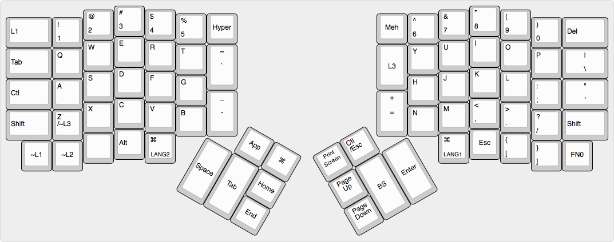
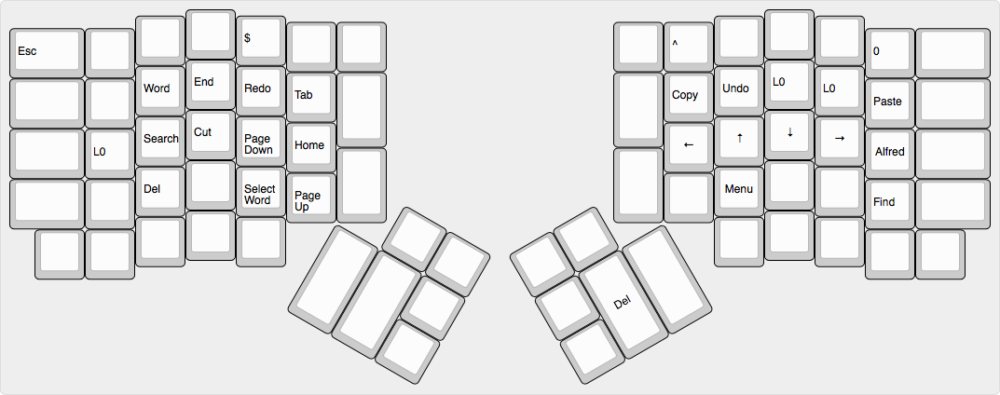
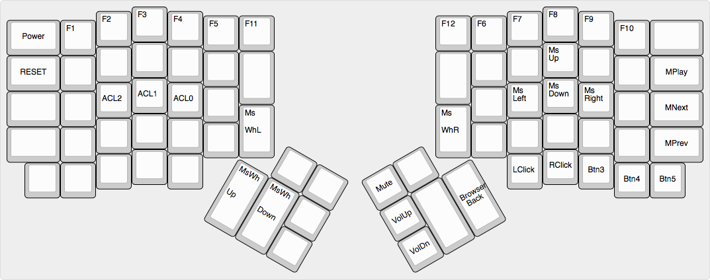
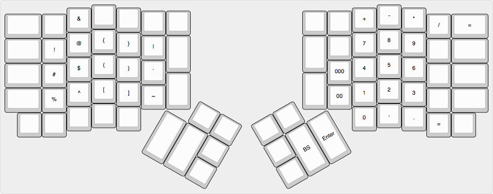

# ergodox vim mode Keymap

## Layer

- Base
- Vim nomal mode
- Mouse
- Symbol

<http://www.keyboard-layout-editor.com>

### Base



### Vim nomal mode



### Mouse



### Symbol



## Build

```
make keymap=kgfnk_osx
```

